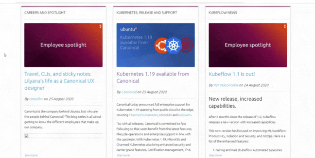

# Blog Canonical
This project is for recruitment process of Canonical and includes a web page with blog posts from [Canonical blog](https://canonical.com/blog). Utilizes Vanilla Framework, React Library and Javascript programming language.

## How to Run

In the project directory, you can run:

### `npm start`

Runs the app in the development mode.\
Open [http://localhost:3000](http://localhost:3000) to view it in your browser.

The page will reload when you make changes.\
You may also see any lint errors in the console.

